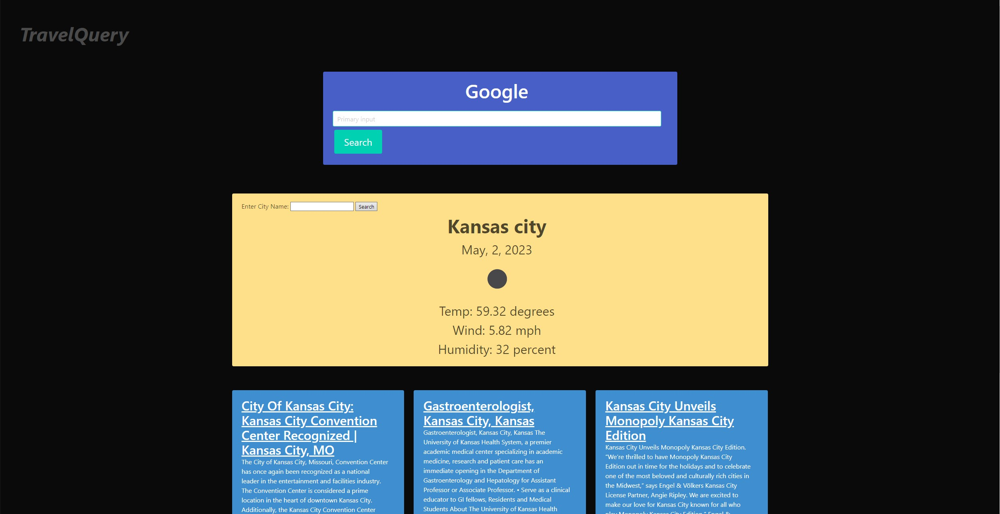

# Project Description
TravelQuery is a light and easy-to-read web tool. It was designed for people who travel often and want an easy way to discover weather and news reports for the town and/or city they are currently staying in. The site also features a search bar connected to the google search engine, to make fast, secure internet searches. 

This is a project site developed by Christopher Tsang, Darien Valet, James Denk, and Vince Rook. It was built for a group project through Kansas University's coding bootcamp program.

The API's used in this site are:

>**Perigon News** [https://www.goperigon.com/data-solutions/news-api?utm_source=google&utm_medium=paid_search&utm_campaign=news-api&gad=1&gclid=CjwKCAjwxr2iBhBJEiwAdXECw2vEUdDA4cQTNVHIQA3wqt6KNavdYoM4fLOeet1mD0tYdylbGqs5YBoC7rIQAvD_BwE]()

>**OpenWeatherMap** [https://openweathermap.org]()

## Page Preview
This is what the site should look like when launched in a supported web browser:

Initial plan for the main page layout:

**Link to the presentation slideshow:**
> [https://docs.google.com/presentation/d/1TuxoYvjsZPYgt0LuQHPJxF-uLpedK99ZekX9DNSKumk/edit#slide=id.g23dc8303e62_0_0]()

## Webpage Link
> **Use this link to view the webpage:** [https://antimatternova.github.io/group-proj-1/]()